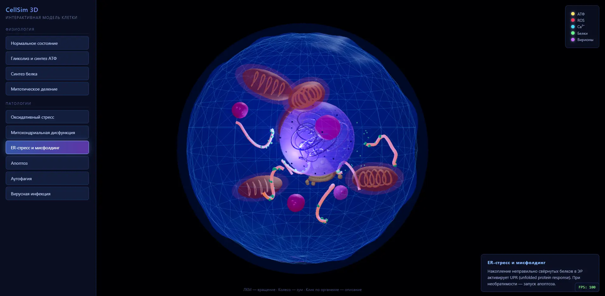

# CellSim 3D

**Интерактивный 3D-симулятор эукариотической клетки в браузере.**

[](https://onewaycursed.github.io/cellsim3d/)
[](LICENSE)
[](https://www.typescriptlang.org/)
[](https://threejs.org/)

---

## 🔬 О проекте

CellSim 3D — бесплатный браузерный симулятор, который показывает эукариотическую клетку в 3D и позволяет в один клик переключаться между её физиологическими и патологическими состояниями: от нормального гомеостаза до оксидативного стресса, апоптоза и вирусной инфекции.

Это не просто 3D-модель, а **симулятор**: состояние клетки — это процесс, а не картинка. При оксидативном стрессе из митохондрий вылетают частицы ROS, митохондрии тускнеют, мембрана меняет цвет. При апоптозе клетка сморщивается. Пользователь видит причинно-следственные связи.

### Ключевые возможности

- 🧬 **10 сценариев состояний** — от нормы до патологий.
- 🎯 **Клик по любому элементу** — митохондрия, ядрышко, кристы, гранулы лизосом. Карточка с описанием и тремя фактами.
- ✨ **Плавные переходы** — цвета, прозрачность и яркость интерполируются за 0.8 секунды.
- 📱 **Мобильная версия** — бургер-меню, оптимизация под тач, 60 FPS без bloom.
- 🌐 **Работает в браузере** — без установки, без регистрации, без плагинов.
- 🆓 **Полностью бесплатно** — MIT License, открытый исходный код.

### Живое демо

**https://onewaycursed.github.io/cellsim3d/**



---

## 📋 Сценарии

### Физиология

| Сценарий | Что показывает |
|---|---|
| Нормальное состояние | Клетка в гомеостазе, органеллы функционируют нормально |
| Гликолиз и синтез АТФ | Митохондрии производят АТФ, частицы движутся по цитоплазме |
| Синтез белка | Транскрипция в ядре → трансляция на ЭР → транспорт через Гольджи |
| Митотическое деление | Конденсация хроматина, расхождение хромосом |

### Патологии

| Сценарий | Что показывает |
|---|---|
| Оксидативный стресс | Накопление ROS, повреждение мембран и митохондрий |
| Митохондриальная дисфункция | Падение продукции АТФ, утечка цитохрома c |
| ER-стресс и мисфолдинг | Накопление неправильно свёрнутых белков, UPR |
| Апоптоз | Программируемая клеточная смерть, сморщивание, фрагментация |
| Аутофагия | Переваривание повреждённых органелл в лизосомах |
| Вирусная инфекция | Проникновение вирионов, перепрограммирование клетки |

### Цветовая кодировка молекул

| Молекула | Цвет |
|---|---|
| АТФ | 🟡 Жёлтый `#ffe066` |
| ROS | 🔴 Красный `#ff3355` |
| Ca²⁺ | 🔵 Голубой `#44ddff` |
| Белки | 🟢 Зелёный `#66ff88` |
| Вирионы | 🟣 Фиолетовый `#cc66ff` |

---

## 🚀 Быстрый старт

### Требования

- **Node.js** 18+ ([скачать LTS](https://nodejs.org/))
- **npm** 9+ (идёт с Node.js)

### Установка

```bash
# Клонировать репозиторий
git clone https://github.com/onewaycursed/cellsim3d.git
cd cellsim3d

# Установить зависимости
npm install

# Запустить в режиме разработки
npm run dev